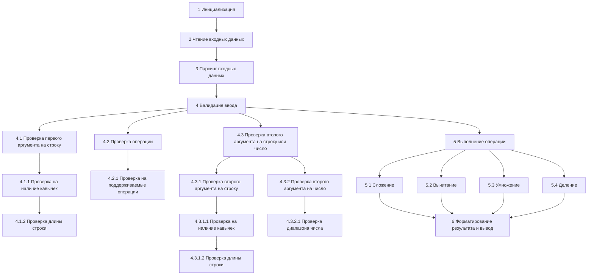

**Условия задачи:**

1. Калькулятор умеет выполнять операции сложения строк, вычитания строки из
строки, умножения строки на число и деления строки на число: "a" + "b", "a" -
"b", "a" * b, "a" / b.
2. Данные передаются в одну строку.
3. Значения строк, передаваемых в выражении, выделяются двойными кавычками.
4. Результатом сложения двух строк является строка, состоящая из переданных.
5. Результатом деления строки на число n является строка в n раз короче исходной.
6. Результатом умножения строки на число n является строка, в которой переданная
строка повторяется ровно n раз.
7. Результатом вычитания строки из строки является строка, в которой удалена
переданная подстрока или сама исходная строка, если в неё нет вхождения
вычитаемой строки.
8. Калькулятор должен принимать на вход числа от 1 до 10 включительно, не более, и
строки длиной не более 10 символов.
9. Если строка, полученная в результате работы приложения, длиннее 40 символов,
то в выводе после 40 символа должны стоять три точки (...).
10. Калькулятор умеет работать только с целыми числами.
11. Первым аргументом выражения, подаваемым на вход, должна быть строка.
12. При вводе неподходящих чисел, строк или неподдерживаемых операций
приложение выдаёт панику и завершает свою работу.
13. При вводе выражения, не соответствующего одной из вышеописанных
арифметических операций, приложение выдаёт панику и завершает свою работу.

___
Пример работы программы:
``` go
Input:
"100" + "500"

Output:
"100500"

Input:
"Hi World!" - "World!"

Output:
"Hi "

Input:
"Bye-bye!" - "World!"

Output:
"Bye-bye!"

Input:
"Golang" * 5

Output:
"GolangGolangGolangGolangGolang"

Input:
"Example!!!" / 3

Output:
"Exa"
```
___

**Алгоритм работы строкового калькулятора:**



1. Инициализация:
-Запустить приложение и подготовить консольный ввод для чтения строки
от пользователя.

3. Чтение входных данных:
- Считать строку, введенную пользователем, которая должна содержать
выражение в формате: "<строка1>" <операция> "<строка2>" или "<строка>"
<операция> <число> (условие 2).

4. Парсинг входных данных:
- Извлечь первую строку, операцию и вторую строку или число из введенной
строки.

5. Валидация ввода:
    3.1 Убедиться, что первый аргумент соответствует условиям (усл. 12, 13):
   - Это строка (условие 11) - у него есть кавычки (усл.3).
   - Первый аргумент длинной не более 10 символов (усл.8)

    3.2 Убедиться, что операция является одной из поддерживаемых: +, -, *, / (усл. 12, 13).

    3.3 Убедиться что второй аргумент соответствует условиям (усл. 12, 13):
    3.3.1 Проверка второго аргумента на строку
    - Определить, что это строка (условие 11) у аргумента есть кавычки (усл.3).
    - Убедиться, что строка не превышают 10 символов в длину (условие 8).
    3.3.2 Проверка второго аргумента на число
    - Или убедиться что это число в диапазоне от 1 до 10 включительно (условие 8).
    

5. Выполнение операции в зависимости от операции:
- Сложение (+): Объединить две строки (условие 4).
- Вычитание (-): Удалить вторую строку из первой. Если второй строки
нет в первой, вернуть нсходную первую строку (условие 7).
- Умножение (*): Повторить первую строку указанное количество раз (условие 6).
- Деление (/): Уменьшить длину первой строки на указанное число раз. Если результат меньше 0, вернуть пустую строку (условие 5).

6. Форматирование результата и вывод:
- Если длина полученной строки превышает 40 символов, обрезать строку до 40 символов и добавить три точки (...) в конце (условие 9).
- Вывести результат в консоль.

7. Обработка ошибок:
- Если на любом этапе происходит ошибка (например, неверный ввод,
неподходящие операции или числа), приложение должно вызвать панику и
завершить свою работу с соответствующим сообщением об ошибке
(условия 12, 13).


